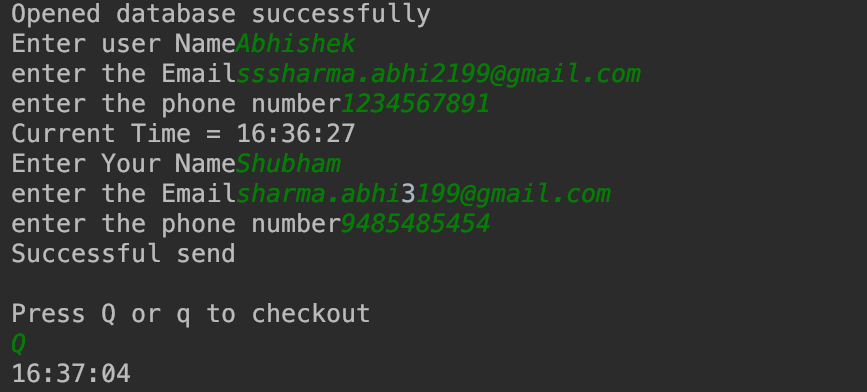
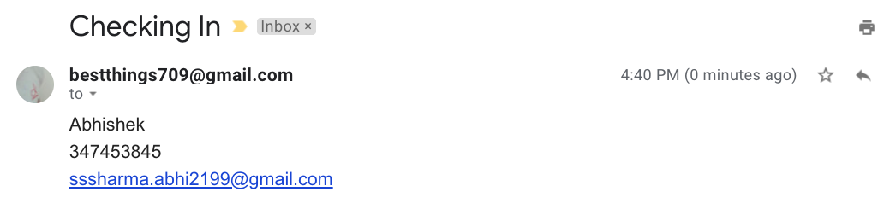
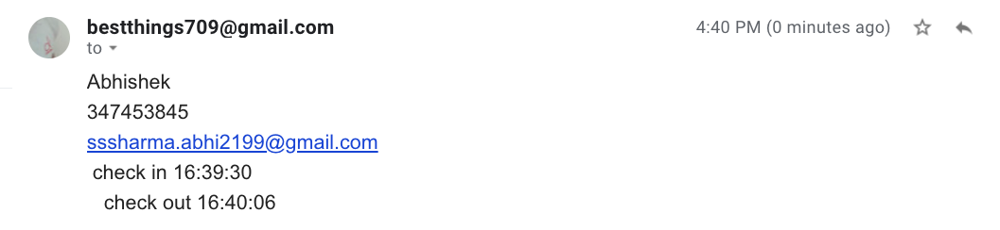

# Entry_management_system
Assignment
# Customer detials
1. Name
2. Email
3. Phone Number
# Host details
1. Name
2. Email
3. Phone Number

# Check IN
Send mail to Host for sharing the details of the customer.
# Check out
Again it will send mail to the host with details.

#All these information are stored in the Sql dataBase

# Modules used
1. Sqlite3
2. datetime
3. Smtplib

# Account used 
1 . Gmail
# Made by only EMAIL

